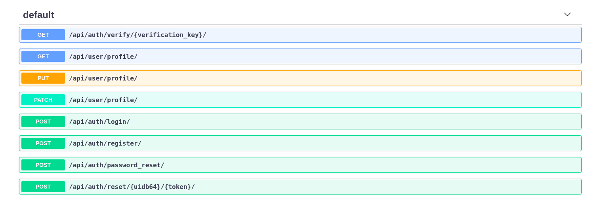

# Django Authentication



## Software

Django, Django Rest, Django Rest Jwt, Swagger

## Guide
You can register using api and further you can use it to manipulate data. Easier way to test data create super user and create profile manually.
Than you can use django_rest_api ouput to update profile. 

To View API Documentation login as Admin  and path is `http://localhost:8000/docs/`

## Development Environment

Tested on Ubuntu 16.04 with anaconda python installed.

### Requirements

You need the following to run this app:

- Python 3.6 or higher (Python 2.x is not supported by Django 2.x)
- [Pipenv](https://pipenv.readthedocs.io/)

### Setup

1. Get source code: git clone https://github.com/deepanshut041/django-authentication.git
2. Open a terminal at the repo root for setting up server
    ```bash
    mkvirtualenv environment
    pip install -r requirements.txt
    python manage.py migrate
    python manage.py runserver
    ```

Server starts at http://localhost:8000

## Screenshots

### User Login view


### User Registration View


### User Profile Update view


## Questions?

If you spot an error when trying to run the app, please file a bug in the GitHub issue tracker.

Please do not create issues or email me asking for support for your own projects. I cannot provide support for your custom applications.